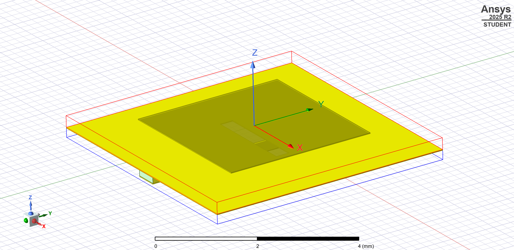
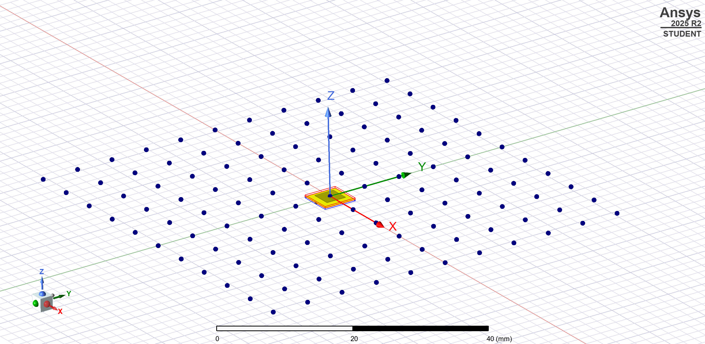
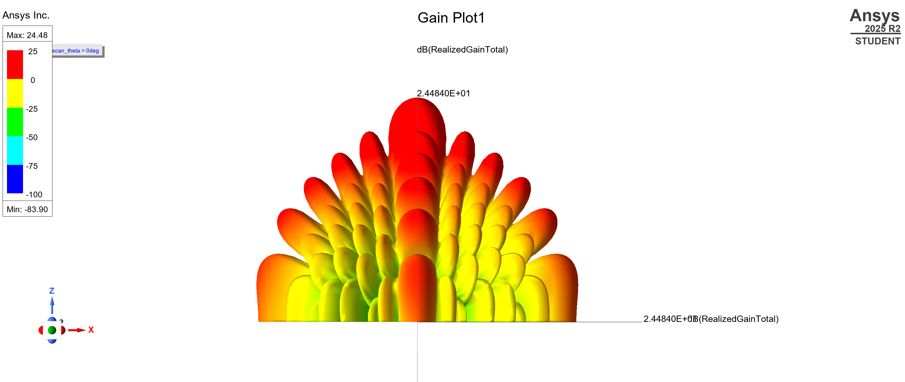

# Designed Modules by Patrick Zhang
## 1. Phased array antenna(aperture coupling)

## 2. Electrically tunable metasurface

## 3. Mechanically tunable metasurface

## 4. Electrically tunable reflectarray

## 5. Mechanically tunable reflectarray

## 6. Four-pole bandpass filter

## 7. Three-one bandpass filter

## 8. Automatic frequency control in EPR spectrometer

